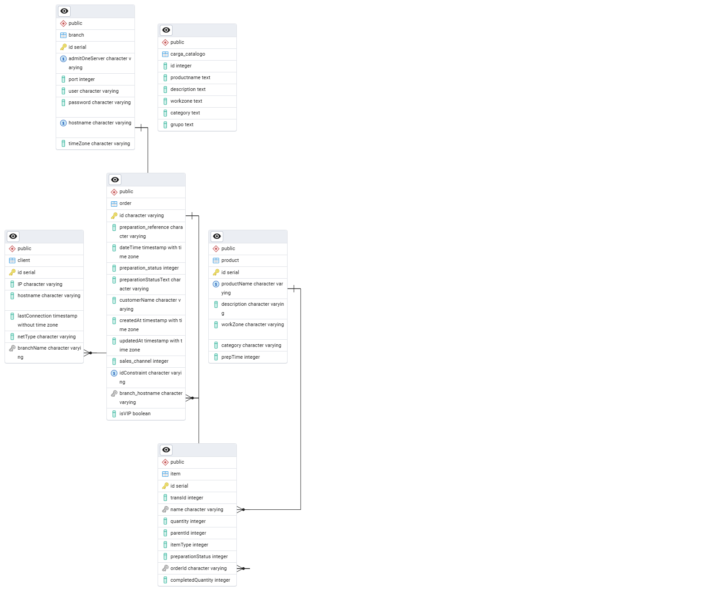

# Kitchen & Order Management Ecosystem 🍳🚀

Este repositorio contiene un ecosistema integral de aplicaciones diseñado para la gestión de pedidos en tiempo real dentro de entornos de alta concurrencia (como cadenas de cine). La solución resuelve desde el ingreso del pedido en cocina hasta la visualización de estados para el cliente final.

## 🏗️ Arquitectura del Sistema
El sistema se basa en una arquitectura de **Single Source of Truth (SSOT)**, donde una API centralizada coordina múltiples clientes multiplataforma.

1. **Backend API (Nest.js):** El motor del sistema. Maneja la lógica de negocio, autenticación y persistencia de datos.
2. **Kitchen Dashboard (Electron + React):** Aplicación de escritorio de baja latencia para que el personal de cocina gestione el flujo de preparación.
3. **Pickup Display (Python + Scala):** Sistema optimizado para pantallas de señalización digital que informa a los usuarios el estado de sus pedidos.


## 🛠️ Tecnologías Utilizadas
- **Backend:** Nest.js, TypeScript, PostgreSQL, TypeORM.
- **Frontend / Desktop:** React, Electron, Tailwind CSS.
- **Scripts & Display:** Python, ScalaScript.
- **Entorno:** Docker (opcional para BD), Git.

## 🗄️ Diseño de Base de Datos
Se implementó un esquema relacional en **PostgreSQL** diseñado para mantener la integridad referencial incluso en picos de alta demanda. El modelo permite un rastreo histórico de cada pedido por folio, tiempo de preparación y estación.

 
*(Nota: Asegúrate de que el nombre del archivo coincida con el que subiste)*

## 🚀 Desafíos Técnicos y Soluciones
- **Sincronización en Tiempo Real:** El reto principal fue asegurar que cuando un cocinero marca un pedido como "Listo" en Electron, la pantalla de Python se actualice instantáneamente. Se resolvió mediante una arquitectura de API REST con optimización de estados en la DB.
- **Integración Multi-lenguaje:** Comunicación fluida entre el backend en Node.js y los scripts de visualización en Python, garantizando tipos de datos consistentes.

## 📦 Instalación y Uso (Desarrollo)

### Requisitos
- Node.js (v18+)
- Python 3.x
- PostgreSQL 14+

### Colección de Postman
- Se incluye una colección de Postman en la carpeta /postman para visualizar los endpoints, payloads y la documentación de la API.

### Configuración Rápida
1. Clonar el repo: `git clone https://github.com/danielsan98/kitchen-management-ecosystem.git`
2. Configurar variables de entorno: Crear un `.env` en `/api-nest-js` siguiendo el `.env.example`.
3. Instalar dependencias:
   ```bash
   # En cada carpeta de proyecto
   npm install
